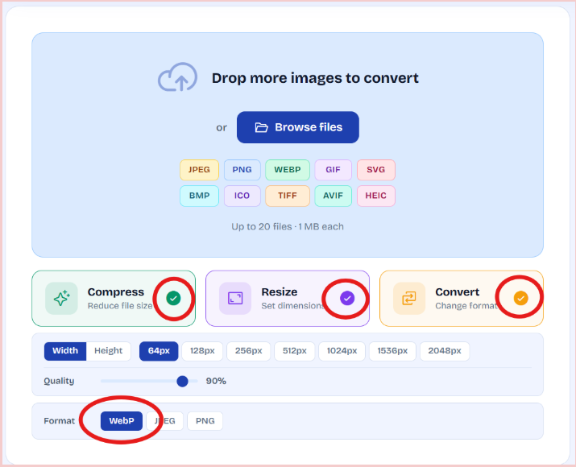
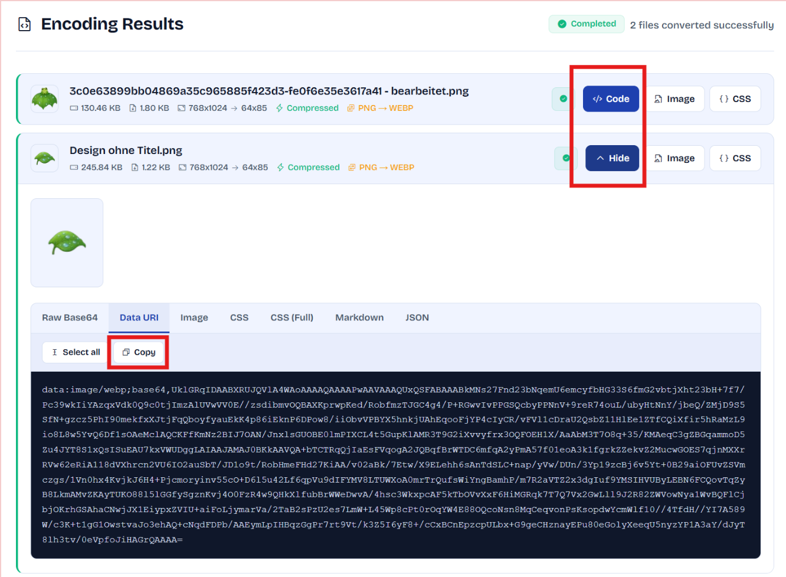
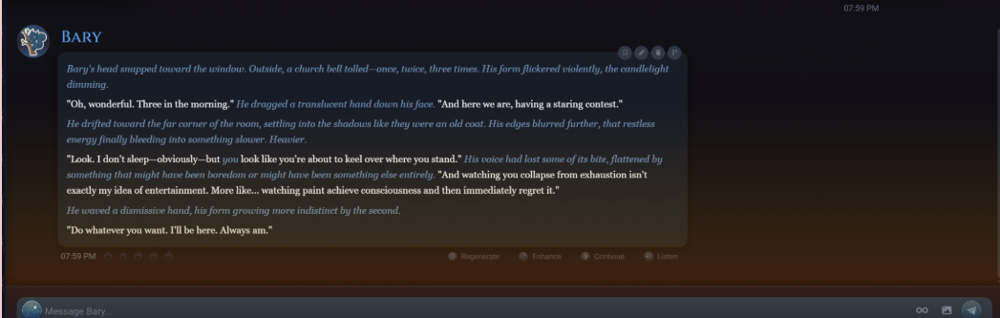
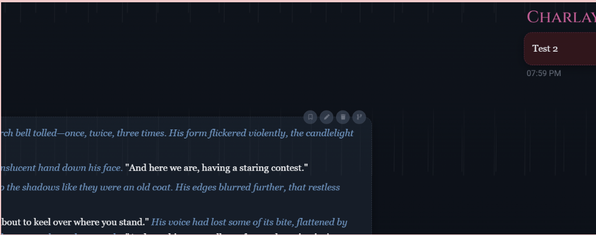

# LoreBary CSS Quick Guide

@harp, thanks for your awesome snippets 🫶🏻

---

## 📋 Table of Contents

- [Converting Images to Base64](#converting-images-to-base64)
  - [How to Get the data:webp Base64 Code](#how-to-get-the-datawebp-base64-code)
- [Avatar Customization](#avatar-customization)
  - [Image around Avatar](#image-around-avatar)
  - [Avatar Glow on Hover](#avatar-glow-on-hover)
  - [Lift Hover](#lift-hover)
  - [Greyscale to Color on Hover](#greyscale-to-color-on-hover)
  - [Remove Avatar Outline/Gradient](#remove-avatar-outlinegradient)
  - [Square Avatar Boxes](#square-avatar-boxes)
- [Chat Bubble Effects](#chat-bubble-effects)
  - [Remove Bubble Message Background](#remove-bubble-message-background)
  - [Bubble Hover Lift](#bubble-hover-lift)
- [Message Layout](#message-layout)
  - [Message Left Aligned](#message-left-aligned)
  - [Centered Chat Messages](#centered-chat-messages)
  - [Colorize Text Selection](#colorize-text-selection)
  - [Hide Timestamp](#hide-timestamp)
  - [Move Timestamp by Name (Right Side)](#move-timestamp-by-name-right-side)
- [Header & Footer](#header--footer)
  - [Hide Avatars in Header](#hide-avatars-in-header)
  - [Hide Chat Name](#hide-chat-name)
  - [Remove Header Border](#remove-header-border)
  - [Remove Header Hairline Stripe](#remove-header-hairline-stripe)
  - [Transparent Footer](#transparent-footer)
  - [Smaller Visual Expression Portrait](#smaller-visual-expression-portrait)
- [Input Controls](#input-controls)
  - [Hide Action Button Labels](#hide-action-button-labels)
  - [Breathing Send Animation](#breathing-send-animation)
  - [Input Buttons Dim Until Hover](#input-buttons-dim-until-hover)
  - [Input Buttons Coloring](#input-buttons-coloring)
  - [Coloring Menu Button](#coloring-menu-button)
  - [Glowing Menu Button](#glowing-menu-button)
- [Background Effects](#background-effects)
  - [Animated Fireshine](#animated-fireshine)
  - [Animated Rain](#animated-rain)

---

## Converting Images to Base64

### How to Get the data:webp Base64 Code

To use custom images in your CSS snippets, you'll need to convert them to Base64 format.

**Step 1: Prepare Your Image**
Get your image file ready (PNG, JPG, WebP, etc.)

**Step 2: Visit Base64 Converter**
Go to [Base64 Converter](https://base64.guru/converter/encode/image)

**Step 3: Configure Converter Settings**
Select every option like the example below:
- ☑️ Enable all available options
- Make sure settings match the configuration shown




**Step 4: Upload Your Image**
Drop your image file into the converter tool

**Step 5: Copy the Code**
- Click the **Code** button to open the generated code
- Click **Copy** to copy the Base64 code to your clipboard



**Step 6: Use in Your CSS**
Replace `XXX` in your CSS snippet with the copied Base64 code:

```css
.lab-theme-scope {
  --character-image: url("data:image/webp;base64,XXX");
  --user-image: url("data:image/webp;base64,XXX");
}
```

**Done!** Your image is now embedded in your CSS. 🎉

---

## Avatar Customization 

### Image around Avatar

Place custom images around your avatar frame. 

```css
.lab-theme-scope {
  --character-image: url("XXX");
  --user-image: url("XXX");
}

.lab-theme-scope [data-lab-role="character"],
.lab-theme-scope [data-lab-role="user"] {
  position: relative !important;
  overflow: visible !important;
}

/* --- Character AVATAR --- */
.lab-theme-scope [data-lab-role="character"]::after {
  content: "" !important;
  display: block !important;
  position: absolute !important;
  width: 90px !important;
  height: 89px !important;
  left: -12px !important;
  top: 12px !important;
  background-image: var(--character-image) !important;
  background-size: contain !important;
  background-repeat: no-repeat !important;
  background-position: center !important;
  transform: rotate(103deg) !important;
  pointer-events: none !important;
  z-index: 99 !important;
}

/* --- USER AVATAR --- */
.lab-theme-scope [data-lab-role="user"]::after {
  content: "" !important;
  display: block !important;
  position: absolute !important;
  width: 120px !important;
  height: 100px !important;
  right: -23px !important;
  top: 16px !important;
  background-image: var(--user-image) !important;
  background-size: contain !important;
  background-repeat: no-repeat !important;
  background-position: center !important;
  transform: rotate(8deg) scaleX(-1) !important;
  pointer-events: none !important;
  z-index: 99 !important;
}
```

**Customization:**
- Replace `XXX` with `data:webp;base64,` code (see [Converting Images to Base64](#converting-images-to-base64))
- `width` + `height`: Set the size of the image
- `left`: Shift the image left and right
- `top`: Shift the image up and down
- `rotate`: Rotate the image

---

### Avatar Glow on Hover

Add a glowing effect when hovering over avatars. 

```css
[data-lab="avatar"]:hover {
  box-shadow: 0 0 10px rgba(81, 160, 222, 0.3) !important;
  transition: box-shadow 0.2s !important;
}
```

---

### Lift Hover

Lift the avatar when you hover over it with a scale effect. 

```css
[data-lab="avatar"] {
  transition: transform 0.25s ease, box-shadow 0.25s ease;
}

[data-lab="avatar"]:hover {
  transform: translateY(-2px) scale(1.05);
  box-shadow: 0 4px 14px rgba(0, 0, 0, 0.4);
}
```

---

### Greyscale to Color on Hover

Transform avatar from greyscale to color when you hover over it. 

```css
[data-lab="avatar"] img {
  filter: grayscale(100%) !important;
  transition: filter 0.3s !important;
}

[data-lab="avatar"]:hover img {
  filter: grayscale(0%) !important;
}
```

**Customization:**
- `img` = default version
- `hover img` = touching version
- `grayscale`: 0 = full color, 100 = no color

---

### Remove Avatar Outline/Gradient

Remove the default avatar outline styling. 

```css
[data-lab="avatar"] {
  background: none !important;
  padding: 0 !important;
}
```

---

### Square Avatar Boxes

Change avatar corners from rounded to square. 

```css
[data-lab="avatar"] {
  border-radius: 8px !important;
}
```

**Customization:**
- Adjust the `px` value for different corner radius (0 = perfectly square)

---

## Chat Bubble Effects

### Remove Bubble Message Background

Make chat bubbles completely transparent.  

```css
[data-lab="bubble"] {
  background: transparent !important;
  border: none !important;
  box-shadow: none !important;
  padding: 0 !important;
}
```

---

### Bubble Hover Lift

Lift chat bubbles slightly when you hover over them. 

```css
[data-lab="bubble"] {
  transition: transform 0.2s ease, box-shadow 0.2s ease !important;
}

[data-lab="bubble"]:hover {
  transform: translateY(-2px) !important;
  box-shadow: 0 4px 12px rgba(0, 0, 0, 0.2) !important;
}
```

---

## Message Layout

### Message Left Aligned

Align user messages to the left side instead of the right. 

Default:  right side: 

```css
[data-lab-role="user"] {
  justify-content: flex-start !important;
}

[data-lab-role="user"] [data-lab="avatar"] {
  order: 0 !important;
}

[data-lab-role="user"] .max-w-\[65\%\] {
  order: 1 !important;
  text-align: left !important;
}
```

**Customization:**
- `order: 0` = avatar appears first (right side)
- Default behavior has avatar on left side like Bary

---

### Centered Chat Messages

Center chat messages with equal room on both sides. 

```css
[data-lab="message"] {
  max-width: 90% !important;
  margin-left: auto !important;
  margin-right: auto !important;
}
```

**Customization:**
- `max-width`: Adjust how close the text should be (100 = default, 90 = closer to center)

---

### Colorize Text Selection

Add color to selected text with a custom background. 

```css
.lab-theme-scope ::selection {
  background: rgba(174, 153, 255, 0.3);
  color: #fff;
}
```

**Customization:**
- `rgba()`: Set your preferred color (RGBA format)

---

### Hide Timestamp

Hide timestamps from all messages. 

```css
[data-lab="time"] {
  display: none !important;
}
```

---

### Move Timestamp by Name (Right Side)

Move timestamps to appear above the chat bubble on the right side. 

```css
[data-lab="message"] > div:has([data-lab="bubble"]) {
  position: relative !important;
}

[data-lab="time"] {
  position: absolute !important;
  top: 4px !important;
  right: 8px !important;
  font-size: 0.7em !important;
}
```

**For left side, change to:**


```css
[data-lab="time"] {
  position: absolute !important;
  top: 4px !important;
  left: 120px !important;
}
```

**Customization:**
- `font-size`: Changes the timestamp size
- `right`: Delete to set the timestamp to the left
- `top`: Delete to set the timestamp below the chat bubble

---

## Header & Footer

### Hide Avatars in Header

Remove avatar display from the chat header. 

```css
[data-lab="header"] [data-lab="avatar"],
[data-lab="header"] [data-lab="avatar"] + div {
  display: none !important;
}
```

---

### Hide Chat Name

Hide the chat name/title in the header. 

```css
[data-lab="header-title"] > :first-child {
  font-size: 0 !important;
}
```

---

### Remove Header Border

Remove the border or shadow beneath the header. 

```css
[data-lab="header"] {
  border-bottom: none !important;
  box-shadow: none !important;
}
```

---

### Remove Header Hairline Stripe

Remove the decorative hairline stripe from the header. 

```css
[data-lab="header"] > [aria-hidden="true"],
[aria-hidden="true"][style*="repeating-linear-gradient"] {
  display: none !important;
}
```

---

### Transparent Footer

Make the footer transparent with a frosted glass effect. 

```css
[data-lab="footer"] {
  background: rgba(0, 0, 0, 0.25) !important;
  backdrop-filter: blur(12px) !important;
  box-shadow: none !important;
  border: none !important;
}

/* Taller input box */
[data-lab="textbox"] {
  min-height: 52px !important;
}
```

**Customization:**
- `background`: Set a custom color (RGBA format)
- `min-height`: Adjust input box height

---

### Smaller Visual Expression Portrait

Scale down the expression portrait display. 

Default  Example: 

```css
[data-lab="expression"] {
  scale: 0.7 !important;
  transform-origin: bottom left !important;
  margin-left: 20px !important;
  margin-bottom: 10px !important;
}
```

**Customization:**
- `scale`: Set the scale factor
- `margin-left`: Set further left/right
- `margin-bottom`: Set further up/down

---

## Input Controls

### Hide Action Button Labels

Hide labels on action buttons (regenerate, enhance, continue, listen) showing only icons. 

```css
[data-lab="action"] {
  font-size: 0 !important;
}

[data-lab="action"] img {
  width: 14px !important;
  height: 14px !important;
}
```

---

### Breathing Send Animation

Make the send button dim and brighten continuously like breathing. 

```css
@keyframes breathe {
  0%, 100% { opacity: 0.5; }
  50%      { opacity: 1; }
}

[data-lab="send"] {
  animation: breathe 2.5s ease infinite !important;
}
```

---

### Input Buttons Dim Until Hover

Dim write and send buttons until you hover over them. 

```css
[data-lab="send"],
[data-lab="write"],
[data-lab="write-options"],
[data-lab="attach-image"],
[data-lab="input"] button[title*="auto" i] {
  opacity: 0.4 !important;
  transition: opacity 0.2s !important;
}

[data-lab="send"]:hover,
[data-lab="write"]:hover,
[data-lab="write-options"]:hover,
[data-lab="attach-image"]:hover,
[data-lab="input"] button[title*="auto" i]:hover {
  opacity: 1 !important;
}
```

**Customization:**
- `opacity`: Set the dimness/brightness (1 = bright, 0.1 = dark)

---

### Input Buttons Coloring

Apply custom color filters to input button icons. 

```css
[data-lab="send"] img,
[data-lab="write"] img {
  filter: brightness(1) sepia(0) saturate(1) hue-rotate(170deg) brightness(1.2) !important;
  opacity: 1 !important;
}
```

---

### Coloring Menu Button

Apply custom color to the menu button. 

```css
img[data-lab="menu"] {
  filter: brightness(0.5) sepia(1) saturate(20) hue-rotate(165deg) brightness(0.9) !important;
  opacity: 1 !important;
}
```

**Customization:**
- `brightness`: 1 = dark, 99 = brightest
- `sepia`: 1 = default, 2 = sepia mode
- `saturate`: 0 = off, 99 = brightest shine
- `hue-rotate`: Adjusts the color

---

### Glowing Menu Button

Add a glowing effect to the menu button. 

```css
[data-lab="menu"] {
  filter: drop-shadow(0 0 8px rgba(255, 255, 255, 0.6)) !important;
}
```

**Customization:**
- `rgba()`: Set the glow color

---

## Background Effects

### Animated Fireshine

Create an animated fire effect at the bottom of the screen.



```css
html, body, #app, main {
  background-color: #0d0505 !important;
}

html::after {
  content: "";
  position: fixed;
  bottom: 0;
  left: 0;
  width: 100vw;
  height: 35vh; /* How high the fire should reach */
  pointer-events: none;
  z-index: 1;
  
  background: linear-gradient(to top, rgba(242, 76, 0, 0.35), rgba(242, 153, 0, 0.15), transparent);
  filter: blur(8px);
  
  animation: lorebaryFire 0.15s ease-in-out infinite alternate;
}

@keyframes lorebaryFire {
  0% {
    transform: scaleY(1);
    opacity: 0.85;
  }
  100% {
    transform: scaleY(1.12) scaleX(1.01);
    opacity: 1;
  }
}

div[class*="chat"], div[class*="message"], .messages-container {
  position: relative;
  z-index: 5 !important;
}
```

---

### Animated Rain

Create a gentle animated rain effect as a background.



```css
html, body, #app, main {
  background-color: #06080c !important;
  position: relative;
}

html::before {
  content: "";
  position: fixed;
  top: -30%;
  left: 0;
  width: 100vw;
  height: 160vh;
  pointer-events: none;
  z-index: 1;
  opacity: 0.12; /* Brightness of first layer */

  background: conic-gradient(from 180deg at 50% 50%, 
    transparent 0deg, 
    rgba(255, 255, 255, 0.5) 0.5deg, 
    transparent 1deg
  );
  background-size: 50px 220px;

  animation: gentleSummerRain1 1.2s linear infinite !important;
}

html::after {
  content: "";
  position: fixed;
  top: -30%;
  left: 0;
  width: 100vw;
  height: 160vh;
  pointer-events: none;
  z-index: 1;
  opacity: 0.10;

  background: conic-gradient(from 180deg at 50% 50%, 
    transparent 0deg, 
    rgba(255, 255, 255, 0.5) 0.5deg, 
    transparent 1deg
  );
  background-size: 45px 240px;

  animation: gentleSummerRain2 1.1s linear infinite !important;
}

@keyframes gentleSummerRain1 {
  0% {
    transform: translateY(0px);
    background-position: 0px 0px;
  }
  100% {
    transform: translateY(220px);
    background-position: 0px 440px;
  }
}

@keyframes gentleSummerRain2 {
  0% {
    transform: translateY(0px);
    background-position: 25px 0px;
  }
  100% {
    transform: translateY(240px);
    background-position: 25px 480px;
  }
}

div[class*="chat"], div[class*="message"], .messages-container, .chat-layout {
  position: relative;
  z-index: 5 !important;
}
```

---

### Animated Fog

Create a gentle fog over the whole screen

```css
html, body, #app, main {
    background-color: #0b0d11 !important; /* Dunkles Graublau als Basis */
    position: relative;
    overflow: hidden;
}

html::before {
    content: "" !important;
    position: fixed !important;
    top: -20%;
    left: -20%;
    width: 140vw;
    height: 140vh;
    pointer-events: none;
    z-index: 1 !important;
    opacity: 0.18; 

    background-image: 
        radial-gradient(circle at 30% 40%, rgba(200, 210, 220, 0.4) 0%, transparent 60%),
        radial-gradient(circle at 70% 60%, rgba(180, 195, 210, 0.3) 0%, transparent 70%);
    filter: blur(40px);
    animation: laboratoryFogMoving1 25s ease-in-out infinite alternate !important;
}

html::after {
    content: "" !important;
    position: fixed !important;
    top: -30%;
    left: -30%;
    width: 160vw;
    height: 160vh;
    pointer-events: none;
    z-index: 2 !important;
    opacity: 0.12;

    background-image: 
        radial-gradient(circle at 50% 50%, rgba(220, 225, 235, 0.3) 0%, transparent 65%),
        radial-gradient(circle at 20% 80%, rgba(160, 175, 190, 0.2) 0%, transparent 55%);
    filter: blur(60px);
    animation: laboratoryFogMoving2 35s ease-in-out infinite alternate !important;
}

@keyframes laboratoryFogMoving1 {
    0% {
        transform: translate(0px, 0px) scale(1) rotate(0deg);
    }
    50% {
        transform: translate(40px, 30px) scale(1.1) rotate(3deg);
    }
    100% {
        transform: translate(-20px, 50px) scale(0.95) rotate(-2deg);
    }
}

@keyframes laboratoryFogMoving2 {
    0% {
        transform: translate(0px, 0px) scale(1) rotate(0deg);
    }
    50% {
        transform: translate(-50px, 40px) scale(1.05) rotate(-4deg);
    }
    100% {
        transform: translate(30px, -20px) scale(1) rotate(2deg);
    }
}

div[class*="chat"], div[class*="message"], .messages-container, .chat-layout {
    position: relative;
    z-index: 5 !important;
}
```

---

### Animated Snow

Let's gentle snow fall in the background.

```css
html, body, #app, main {
    background-color: #060810 !important;
    position: relative;
    overflow: hidden;
}

html::before {
    content: "" !important;
    position: fixed !important;
    top: -10%;
    left: -10%;
    width: 120vw;
    height: 120vh;
    pointer-events: none;
    z-index: 1 !important;
    opacity: 0.22;
    background-image: 
        radial-gradient(circle, #ffffff 10%, transparent 11%),
        radial-gradient(circle, #ffffff 7%, transparent 8%),
        radial-gradient(circle, #ffffff 9%, transparent 10%),
        radial-gradient(circle, #ffffff 6%, transparent 7%);
    background-size: 140px 140px; 
    background-position: 13px 27px, 89px 113px, 47px 71px, 119px 43px;

    animation: 
        endlessSnow1 22s linear infinite,
        snowWobble1 7s ease-in-out infinite alternate !important;
}

html::after {
    content: "" !important;
    position: fixed !important;
    top: -10%;
    left: -10%;
    width: 120vw;
    height: 120vh;
    pointer-events: none;
    z-index: 2 !important;
    opacity: 0.14;
    background-image: 
        radial-gradient(circle, #ffffff 6%, transparent 7%),
        radial-gradient(circle, #ffffff 4%, transparent 5%),
        radial-gradient(circle, #ffffff 5%, transparent 6%),
        radial-gradient(circle, #ffffff 3%, transparent 4%);
    background-size: 110px 110px;
    background-position: 7px 83px, 53px 19px, 97px 61px, 29px 101px;

    animation: 
        endlessSnow2 34s linear infinite,
        snowWobble2 11s ease-in-out infinite alternate !important;
}

@keyframes endlessSnow1 {
    0% { 
        background-position: 13px 27px, 89px 113px, 47px 71px, 119px 43px; 
    }
    100% { 
        background-position: 13px 447px, 89px 533px, 47px 491px, 119px 463px; 
    }
}

@keyframes endlessSnow2 {
    0% { 
        background-position: 7px 83px, 53px 19px, 97px 61px, 29px 101px; 
    }
    100% { 
        background-position: 7px 413px, 53px 349px, 97px 391px, 29px 431px; 
    }
}

@keyframes snowWobble1 {
    0% { transform: translateX(0px) rotate(0deg) scale(1); }
    50% { transform: translateX(30px) rotate(1deg) scale(1.04); }
    100% { transform: translateX(-20px) rotate(-1deg) scale(0.96); }
}

@keyframes snowWobble2 {
    0% { transform: translateX(15px) rotate(0deg); }
    100% { transform: translateX(-35px) rotate(2deg); }
}

div[class*="chat"], div[class*="message"], .messages-container, .chat-layout {
    position: relative;
    z-index: 5 !important;
}
```

---

### Animated Fireflies

Let's fireflies fly through your screen

```css
html, body, #app, main {
    background-color: #040605 !important; /* Tiefschwarz mit einem Hauch Waldgrün */
    position: relative;
    overflow: hidden;
}

html::before {
    content: "" !important;
    position: fixed !important;
    top: -10%;
    left: -10%;
    width: 120vw;
    height: 120vh;
    pointer-events: none;
    z-index: 1 !important;
    opacity: 0.35; 

    background-image: 
        radial-gradient(circle, rgba(204, 255, 51, 1) 0%, rgba(204, 255, 51, 0.3) 3%, transparent 12%),
        radial-gradient(circle, rgba(175, 255, 40, 1) 0%, rgba(175, 255, 40, 0.2) 2%, transparent 10%),
        radial-gradient(circle, rgba(220, 255, 80, 1) 0%, rgba(220, 255, 80, 0.3) 4%, transparent 15%),
        radial-gradient(circle, rgba(204, 255, 51, 1) 0%, rgba(204, 255, 51, 0.1) 2%, transparent 8%);
    background-size: 300px 300px; 
    background-position: 43px 187px, 213px 61px, 127px 243px, 267px 19px;

    animation: 
        minimalFirefliesRise 45s linear infinite,
        minimalFirefliesWobble 9s ease-in-out infinite alternate !important;
}

@keyframes minimalFirefliesRise {
    0% { 
        background-position: 43px 187px, 213px 61px, 127px 243px, 267px 19px; 
    }
    100% { 
        background-position: 43px -113px, 213px -239px, 127px -57px, 267px -281px; 
    }
}

@keyframes minimalFirefliesWobble {
    0% { 
        transform: translateX(0px) translateY(0px); 
        opacity: 0.1; 
    }
    40% {
        transform: translateX(20px) translateY(-10px);
        opacity: 0.6; 
    }
    70% {
        transform: translateX(-15px) translateY(15px);
        opacity: 0.05; 
    }
    100% { 
        transform: translateX(10px) translateY(-5px); 
        opacity: 0.4;
    }
}

div[class*="chat"], div[class*="message"], .messages-container, .chat-layout {
    position: relative;
    z-index: 5 !important;
}
```

---

### Animated Dustparticle

Let's dust hover at the screen

```css
 position: relative;
    overflow: hidden;html, body, #app, main {
    background-color: #020204 !important; 

}

html::before {
    content: "" !important;
    position: fixed !important;
    width: 1.5px !important;
    height: 1.5px !important;
    top: 0;
    left: 0;
    background: transparent;
    pointer-events: none;
    z-index: 2 !important;
    box-shadow: 
        120px 240px #ffffff,   340px 80px rgba(255,255,255,0.8),  560px 420px #ffffff,
        780px 150px rgba(255,255,255,0.9),  910px 620px #ffffff,  210px 710px rgba(255,255,255,0.7),
        430px 890px #ffffff,   850px 330px rgba(255,255,255,0.8),  620px 780px #ffffff,
        150px 520px rgba(255,255,255,0.9),  950px 210px #ffffff,  710px 920px rgba(255,255,255,0.7),
        1100px 110px #ffffff,  1250px 480px rgba(255,255,255,0.8), 1380px 750px #ffffff,
        1520px 310px rgba(255,255,255,0.9), 1680px 820px #ffffff, 1850px 190px rgba(255,255,255,0.7),
        50vw 25vh #ffffff,     85vw 60vh rgba(255,255,255,0.9),   15vw 75vh #ffffff;

    animation: naturalCosmosTwinkle 4s ease-in-out infinite alternate !important;
}

html::after {
    content: "" !important;
    position: fixed !important;
    top: -30%;
    left: -30%;
    width: 160vw;
    height: 160vh;
    pointer-events: none;
    z-index: 1 !important;
    opacity: 0.22;

    background-image: 
        radial-gradient(circle at 25% 25%, rgba(138, 43, 226, 0.3) 0%, transparent 55%),  
        radial-gradient(circle at 75% 65%, rgba(0, 102, 204, 0.25) 0%, transparent 60%);  
    
    filter: blur(60px);
    animation: cosmosNebulaMove 50s ease-in-out infinite alternate !important;
}

@keyframes naturalCosmosTwinkle {
    0% {
        opacity: 0.25;
        transform: scale(0.98);
    }
    100% {
        opacity: 0.75;
        transform: scale(1.02); 
    }
}

/* --- ANIMATION: NEBELWABERN --- */
@keyframes cosmosNebulaMove {
    0% { transform: translate(0px, 0px) rotate(0deg); }
    100% { transform: translate(30px, 40px) rotate(1deg); }
}

div[class*="chat"], div[class*="message"], .messages-container, .chat-layout {
    position: relative;
    z-index: 5 !important;
}

```

---

### Animated Stars

Let's stars twinkle in your background

```css
html, body, #app, main {
    background-color: #020204 !important; 
    position: relative;
    overflow: hidden;
}

html::before {
    content: "" !important;
    position: fixed !important;
    width: 1.2px !important;
    height: 1.2px !important;
    top: 0;
    left: 0;
    background: transparent;
    pointer-events: none;
    z-index: 2 !important;
    border-radius: 50% !important;

    box-shadow: 
        120px 240px #ffffff,   340px 80px rgba(255,255,255,0.4),  560px 420px #ffffff,
        780px 150px rgba(255,255,255,0.7),  910px 620px #ffffff,  210px 710px rgba(255,255,255,0.3),
        430px 890px #ffffff,   850px 330px rgba(255,255,255,0.5),  620px 780px #ffffff,
        150px 520px rgba(255,255,255,0.6),  950px 210px #ffffff,  710px 920px rgba(255,255,255,0.4),
        1100px 110px #ffffff,  1250px 480px rgba(255,255,255,0.5), 1380px 750px #ffffff,
        1520px 310px rgba(255,255,255,0.7), 1680px 820px #ffffff, 1850px 190px rgba(255,255,255,0.3),
        50vw 25vh rgba(255,255,255,0.8),     85vw 60vh #ffffff,   15vw 75vh rgba(255,255,255,0.5),
        250px 180px rgba(255,255,255,0.4), 680px 50px #ffffff,   1150px 800px rgba(255,255,255,0.5),
        1420px 910px #ffffff,  1710px 430px rgba(255,255,255,0.6),
        250px 350px 0 1.2px #ffffff,        
        1450px 180px 0 1.5px #ffffff,       
        650px 600px 0 1.3px rgba(255,255,255,0.9), 
        80vw 80vh 0 1.4px #ffffff,          
        35vw 75vh 0 1.2px rgba(255,255,255,0.9);   

    animation: staticCosmosTwinkle 5s ease-in-out infinite alternate !important;
}

html::after {
    content: "" !important;
    position: fixed !important;
    top: -30%;
    left: -30%;
    width: 160vw;
    height: 160vh;
    pointer-events: none;
    z-index: 1 !important;
    opacity: 0.20;

    background-image: 
        radial-gradient(circle at 25% 25%, rgba(138, 43, 226, 0.3) 0%, transparent 55%),  
        radial-gradient(circle at 75% 65%, rgba(0, 102, 204, 0.25) 0%, transparent 60%);  
    
    filter: blur(60px);
    animation: cosmosNebulaMove 60s ease-in-out infinite alternate !important;
}

@keyframes staticCosmosTwinkle {
    0% { opacity: 0.3; }
    100% { opacity: 0.85; }
}

@keyframes cosmosNebulaMove {
    0% { transform: translate(0px, 0px) rotate(0deg); }
    100% { transform: translate(20px, 30px) rotate(0.5deg); }
}

div[class*="chat"], div[class*="message"], .messages-container, .chat-layout {
    position: relative;
    z-index: 5 !important;
}

```

---

### AnimatedSun underwater with bubbles

Sunshine under water with small rising bubbles

```css
html, body, #app, main {
    background-color: #080a10 !important; 
    position: relative;
    overflow: hidden;
}

html::before {
    content: "" !important;
    position: fixed !important;
    bottom: -20% !important;
    left: -10vw !important;
    width: 120vw !important;
    height: 140vh !important;
    pointer-events: none !important;
    z-index: 1 !important;
    opacity: 0.35;

    background-image: 
        radial-gradient(circle at 120px 280px, #ffffff 1px, transparent 2px),
        radial-gradient(circle at 120px 280px, transparent 2px, rgba(255, 255, 255, 0.3) 3px, transparent 4px),
        radial-gradient(circle at 380px 140px, #ffffff 0.5px, transparent 1.5px),
        radial-gradient(circle at 380px 140px, transparent 1.5px, rgba(255, 255, 255, 0.25) 2.5px, transparent 3.5px);
    
    background-size: 500px 500px, 700px 700px !important;
    background-repeat: repeat !important;

    animation: 
        bubblesUltraSlowRise 65s linear infinite,
        bubblesUltraSlowWobble 9s ease-in-out infinite alternate !important;
}

html::after {
    content: "" !important;
    position: fixed !important;
    top: -20% !important; 
    left: 10% !important; 
    width: 100vw !important;
    height: 70vh !important; 
    pointer-events: none !important;
    z-index: 2 !important; 
    background: linear-gradient(135deg, 
        rgba(255, 255, 255, 0.22) 0%, 
        rgba(255, 255, 255, 0.12) 15%, 
        rgba(255, 255, 255, 0.04) 40%, 
        transparent 70%
    );

    filter: blur(45px) !important;
    animation: holyLightGlow 8s ease-in-out infinite alternate !important;
    transform-origin: top center !important;
}

@keyframes bubblesUltraSlowRise {
    0% { background-position: 0px 0px, 200px 0px; }
    100% { background-position: 0px -3500px, 200px -3500px; }
}

@keyframes bubblesUltraSlowWobble {
    0% { transform: translateX(0px); }
    50% { transform: translateX(20px); }
    100% { transform: translateX(-15px); }
}

@keyframes holyLightGlow {
    0% {
        opacity: 0.40; 
        transform: scale(0.95) rotate(0deg);
    }
    50% {
        opacity: 0.85; 
        transform: scale(1.05) rotate(1deg); 
    }
    100% {
        opacity: 0.50;
        transform: scale(0.98) rotate(-0.5deg);
    }
}

div[class*="chat"], div[class*="message"], .messages-container, .chat-layout {
    position: relative;
    z-index: 5 !important;
}

```

---

### Animated soft shine top

Creates a soft shine at the top of the screen.

```css
html, body, #app, main {
    background-color: #06080c !important; 
    position: relative;
    overflow: hidden;
}

html::after {
    content: "" !important;
    position: fixed !important;
    top: -25% !important; 
    left: 0 !important;
    right: 0 !important;
    margin: 0 auto !important; 
    width: 85vw !important; 
    height: 80vh !important; 
    pointer-events: none !important;
    z-index: 1 !important; 
    background: linear-gradient(to bottom, 
        rgba(255, 210, 120, 0.26) 0%, 
        rgba(255, 185, 80, 0.16) 20%, 
        rgba(230, 150, 50, 0.05) 50%, 
        transparent 85%
    );

    filter: blur(55px) !important;
    animation: holyGoldenGlow 9s ease-in-out infinite alternate !important;
    transform-origin: top center !important;
}

@keyframes holyGoldenGlow {
    0% {
        opacity: 0.45; 
        transform: scaleX(0.92) scaleY(0.96); 
    }
    50% {
        transform: scaleX(1.06) scaleY(1.03); 
    }
    100% {
        opacity: 0.55;
        transform: scaleX(0.96) scaleY(0.98);
    }
}

div[class*="chat"], div[class*="message"], .messages-container, .chat-layout {
    position: relative;
    z-index: 5 !important;
}

```

---

**Last Updated:** 2026-07-13
